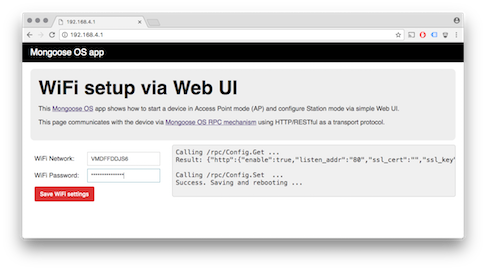

# Setup WiFi via Web UI

## Overview

- Do not configure WiFi - leave the module in AP (Access Point mode).
- Mongoose OS starts a WiFi network called `Mongoose_XXXXXX` with password
`Mongoose`. Switch your workstation to that WiFi network
- Point your browser to http://192.168.4.1
- You'll see a simple form to configure WiFi network & password

  

## How to install this app

- Install and start [mos tool](https://mongoose-os.com/software.html)
- Switch to the Project page, find and import this app, build and flash it:

  

